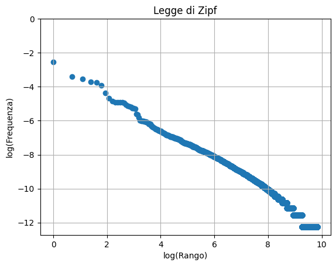

# La legge nascosta

| **Tema**                 | Analisi statistica di un testo, legge di potenza e scala log-log                           |
|:-------------------------|:-------------------------------------------------------------------------------------------|
| **Scopo (DigComp)**      | Comprendere come dati e addestramento influenzano l'affidabilità dell'IA (**CS1.2.08**)    |
| **Pre-requisiti**        | Frequenza assoluta e relativa, ordinamento, logaritmi e proprietà, proprietà delle potenze |
| **Durata**               | 2 ore                                                                                      |
| **Target**               | Studenti del triennio, classe terza                                                        |
| **Setting della classe** | Laboratorio di informatica con computer per ogni  studente e scheda dell'attività.         |

## File necessari e condivisione
Gli studenti lavorano singolarmente all'**analisi di caso**. 
Viene fornito ad ogni studente il testo dell'[esercitazione_parte2](../lab_frequenze_testo/esercitazione_parte2.pdf)
Il testo è scritto in latex e i sorgenti sono disponibili nella cartella materiali.
Si consiglia di utilizzare Colab e classroom creando un 
compito con il notebook [esercitazione_parte1_3](../lab_frequenze_testo/esercitazione_parte1_3.ipynb) 
con una copia per ogni studente.
 

## Fasi della lezione

### Presentazione del caso studio (20 minuti)
Utilizzare il README del laboratorio condividendolo con
gli studenti o proiettandolo per introdurre il caso studio. Si chiede agli studenti di 
ricavare la **legge di Zipf**. In questa prima fase, agli studenti viene solo detto che c'è una
legge matematica nascosta in ogni testo e loro la dovranno trovare.

Per prima cosa, dovranno contare le parole e quindi si forniranno agli strumenti alcuni
concetti come parola token, parola tipo, frequenza relativa e assoluta.

### Esercitazione parte 1 (30 minuti)
In questa fase gli studenti saranno guidata passo dopo passo tramite il notebook [esercitazione_parte1_3](../lab_frequenze_testo/Esercitazione_parte1_3.ipynb)
a scoprire la legge. Il dataset a disposizione sono i contenuti di Wikipedia. In prima fase usare
il dataset test per avere tempi di lettura dei dati più sostenibili in classe.

Gli studenti riporteranno nel piano cartesiano il logaritmo delle frequenze e il logaritmo del
rango ottenendo una funzione lineare.

Il grafico ottenuto con il dataset test è il seguente:

)

### Esercitazione parte 2 (20 minuti)

Gli studenti hanno a disposizione il grafico della legge di Zipf nell'[esercitazione_parte2](../lab_frequenze_testo/Esercitazione_parte2.pdf).
Si chiede di tracciare la retta che meglio interpola i punti e di calcolare
coefficiente angolare e quota con l'aiuto di un righello. 
Si suggerisce di considerare che i punti con rango più alto sono di più e quindi di cercare
di interpolare meglio quelli.

Individuati *m* e *q* e scritta l'equazione della retta, tramite le proprietà dei logaritmi
si ricava la legge di Zipf.

Si può osservare che una legge di potenza in un piano loglog è rappresentata da una retta.

### Esercitazione parte 3 (15 minuti)
Si riapre l'esercitazione e si verificano i valori di *m* e *q* trovati confrontando il 
grafico della legge di Zipf con i dati reali.

Con il seguente codice si possono ottenere i valori di *m* e *q* della retta che meglio
interpola i dati e confrontarli con quelli ottenuti dagli studenti, soprattutto in caso 
di difficoltà o valori che si discostano troppo dai dati reali.

```
m, q = np.polyfit(log_rango, log_freq, 1)
print(m, q)
```
Se si prova a utilizzare il dataset di train l'esponente tenderà ad uno, questo accade
con i corporta di grandi dimensioni.

Importante è contare il numero di **hapax legomena** cioè di parole che
compaiono una volta sola nel testo e sottolineare che questo schema è presente in tutte le lingue;
fare poi riflettere su come l'AI abbia bisogno di corpora di 
grandi dimensioni anche per questo motivo. La maggior parte delle parole, infatti, compare
una volta solamente nei testi soprattutto se la loro lunghezza è limitata.

### Riflessioni e discussioni (15 minuti)

Dare spazio all'attività di *debriefing* a partire da queste domande stimolo:
1. Quali sono le conseguenze della legge di Zipf sull'AI?
2. Potrebbe sempre esserci una parola che non è mai stata vista in un testo?

Si possono usare strumenti digitali come https://www.mentimeter.com/ per favorire la discussione e riflessione.

Con questo brainstorming si cerca di comprendere come gli hapax influenzino la dimensione dei corpora
e come sia stato fondamentale ottimizzare lo spazio 
di archiviazione e l'efficienza del recupero dei dati per creare questi modelli.
Gli studenti possono riflettere sul fatto che i pattern testuali influenzano l'AI
e sviluppare la consapevolezza che la qualità e la struttura del corpus di addestramento 
determina l'output della macchina.

Si può aggiungere un'attività a casa e chiedere agli studenti di 
cercare o riflettere su altri fenomeni anche legati a internet e ai social-network che seguono questa legge.