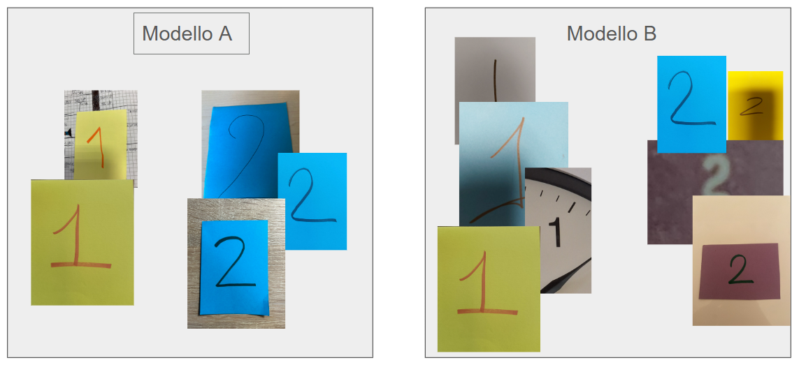

# L'importanza dei dati

| **Tema**                 | Costruzione di una **matrice di confusione** per confrontare due modelli di ML                                                                          |
|:-------------------------|:--------------------------------------------------------------------------------------------------------------------------------------------------------|
| **Scopo (DigComp3.0)**   | Comprendere come dati e addestramento influenzano l'affidabilità dell'IA (**CS1.2.08**)                                                                 |
| **Pre-requisiti**        | Tabella a doppia entrata                                                                                                                                |
| **Durata**               | 1-2 ore                                                                                                                                                 |
| **Target**               | Studenti del Biennio                                                                                                                                    |
| **Setting della classe** | Dividere la classe in due gruppi, a un gruppo viene assegnato il modello A e ad un gruppo il modello B. Assegnare almeno un computer ogni due studenti. |

# Descrizione e fasi della lezione

## File necessari e condivisione
Gli studenti vengono suddivisi in due gruppi A e B. Assicurarsi che la coppia o il singolo
studente con il modello A sia vicino a uno studente con il modello B per potersi
confrontare alla fine della lezione durante la discussione.
Si consiglia di utilizzare Colab e classroom creando un 
compito con il notebook [esercitazione.ipynb](../lab_importanza_dei_dati/esercitazione.ipynb) 
con una copia per ogni studente.
Assicurarsi che ogni studente abbia scaricato in locale i seguenti file:
1. [Immagini di Test](../lab_importanza_dei_dati/dati_test) 
2. [Modello assegnato](../lab_importanza_dei_dati/modelli) 

## Fasi della lezione
Utilizzare il readme del laboratorio con le diverse fasi condividendolo con
gli studenti o proiettandolo. Per una lezione di 1 ora, la prima fase deve 
essere sintetizzata in modo da permettere agli studenti di costruire la matrice di 
confusione. 
Con 2 ore si può lasciare più spazio alla discussione finale e al confronto dei modelli.
### Introduzione al machine learning (10 minuti-15 minuti)
L'obiettivo è di far comprendere con un esempio legato alla fisica del biennio il cambio 
di paradigma nella modellazione matematica.
### Implementazione del modello (15 minuti-20 minuti)
Assicurarsi che siano stati scaricati tutti i file necessari (.tm e immagini di test) e
che a seconda del gruppo assegnato ogni studente carichi il progetto .tm per il training.
Teachable machine, dopo aver aperto il progetto, ti permette di visualizzare i dati di training
ma, in questa fase, il docente non osserva le differenze tra i due modelli. I dati vengono
visualizzati solo dopo la costruzione della matrice di accuratezza.
Fare la previsione assieme con un'immagine dal dataset di test assieme.
### Esercitazione (15-20 minuti)
Dopo aver spiegato la matrice di confusione chiedere agli studenti di contare le previsioni
corrette e non corrette per il calcolo dell'accuratezza.
Essendo solo 20 immagini, il calcolo e matrice possono essere costruite con carta e penna.
Qualora si voglia avvicinare gli studenti a Python e al coding si può iniziare con questo 
semplice notebook.
### Discussione (10-20 minuti)
Chiedere agli studenti quali accuratezze hanno ottenuto. Gli studenti con il modello 
A ottengono un'accuratezza inferiore a quelli con il modello B. Discutere sui fattori
che possono aver influenzato le performance incentivando le interazioni con l'altro gruppo.
I fattori principali sono due:
1. scarsa variabilità dei dati nel modello A
2. numerosità limitata nel modello A (in generale non è rispettata la suddivisione 80\% e 20\%
tra training e test)

Si potrebbe discutere sulla presenza di BIAS e stereotipi: "tutti i cartoncini gialli sono
numeri 1".

