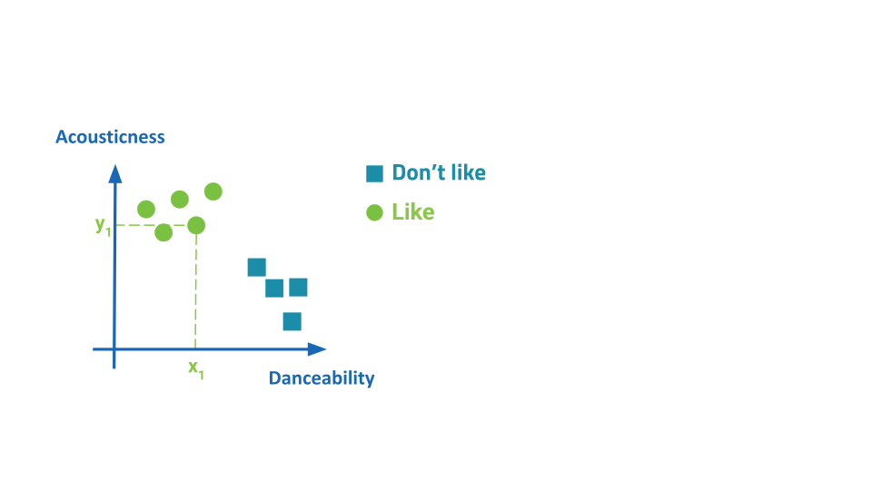
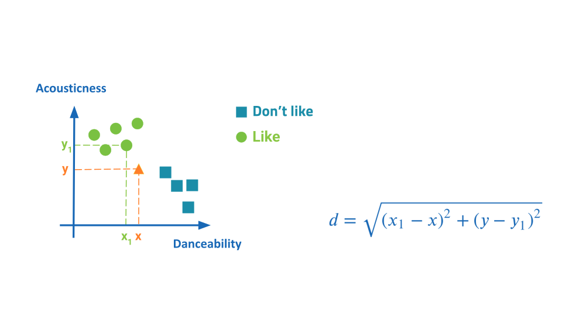
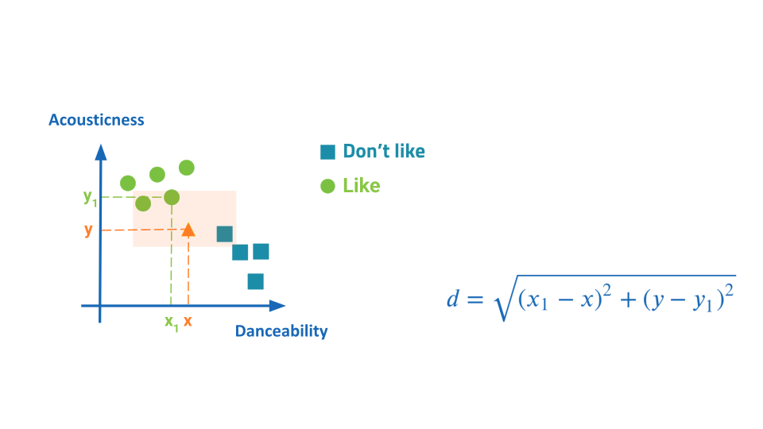

# Distanza euclidea e machine learning

| **Tema**                    | Calcolare la distanza tra due punti per comprendere la matematica alla base degli algoritmi di machine learning                                                                                                                                                           |
|:----------------------------|:--------------------------------------------------------------------------------------------------------------------------------------------------------------------------------------------------------------------------------------------------------------------------|
| **Obiettivi**               | Confrontare ed analizzare figure geometriche, individuando invarianti e relazioni.  Riconoscere che il machine learning è un tipo di programmazione utilizzato nell'IA che permette agli algoritmi di apprendere dai dati e fare previsioni (**CS3.4.09, Digcomp3.0**) |
| **Pre-requisiti**           | Il piano cartesiano, distanza tra due punti, teorema di Pitagora, tabella di frequenza a doppia entrata                                                                                                                                                                   |

## Caso di studio

Il responsabile del marketing ti chiede di **incrementare i profitti** della piattaforma di contenuti musicali per cui lavori.
Per raggiungere questi obiettivi decidi di contattare un **esperto per lo sviluppo di un algoritmo di IA** per **prevedere 
i gusti degli utenti**. 

Prima di adottare il modello, il responsabile del marketing ti chiede una **valutazione dei risultati ottenuti** e il tuo 
parere per l’adozione di modelli simili nella tua piattaforma. Per testare il modello vengono
usati i dati di un cliente di nome George.

## I gusti musicali di George

George comunica a una nota piattaforma musicale i suoi gusti attraverso i suoi ascolti o i suoi like. 
Questi dati sono stati realmente messi a disposizione da George su [Kaggle](https://www.kaggle.com/datasets/geomack/spotifyclassification/data). 
È possibile infatti scaricare le canzoni e le loro caratteristiche dalla piattaforma attraverso [API]( https://developer.spotify.com/documentation/web-api/reference/get-audio-features).

Conosci quindi le canzoni di George e ascolti due tracce musicali per capire i suoi gusti:
1. una canzone che [piace a George](https://youtu.be/k49I5m1J6Is) :+1:
2. una canzone che [non piace a George](https://youtu.be/lhhBg6WLjoU) :-1:

Un algoritmo a disposizione della piattaforma analizza la traccia audio della canzone e ricava degli indicatori come 
*danceability*, *energy*, *duration*, *acousticness* come puoi vedere dal [file](./dati_training/data.csv) 
messo a disposizione dall'esperto.

## L'esperto analizza i dati

L'esperto ti suggerisce di suddividere i dati in due parti:
1. l'80% dei dati ti servono per addestrare il modello, trovare cioè quei parametri e/o quella funzione che meglio
riesce a rappresentare il fenomeno che stai studiando.
2. usi il modello addestrato per prevedere, classificare,
etc il restante 20% dei dati confrontando la previsione ottenuta con i gusti
reali di George.

### Algoritmo

Ti chiede di scegliere due parametri dal [file](./dati_training/data.csv). I valori assunti dai due parametri
rappresentano le coordinate di un punto nel piano cartesiano. Riporti l'80% dei dati nel piano cartesiano come riportato
in figura.

Considero una nuova canzone sul mercato, piacerà a George? Sai qual è il valore di acousticness che è l’ascissa del punto e 
danceability che è l’ordinata del punto, decidi di proporla a George?
Per valutarlo, calcoli le distanze dagli altri punti (canzoni) nel piano
cartesiano come mostrato in figura.

Decidi di considerare i tre punti più vicino e decidi se la canzone piacerà o non piacerà a George 
in base alla **modalità più frequente**.

Piacerà la nuova canzone a George?

### Fase di test

Come richiesto dal tuo responsabile, decidi di valutare la performance del modello suggerito dall'esperto
sul 20% dei dati, cioè la parte che non hai usato per implementare il modello.

Un metodo per valutare la performance di un modello è calcolare la **matrice di confusione**:

|                            | Target Reale: **Like** | Target Reale: **Don't like** |
|:---------------------------|:----------------------:|:----------------------------:|
| **Predizione: Like**       |   **Vero Like (vL)**   |       Falso Like (fL)        |
| **Predizione: Don't like** | Falso Don't Like (fD)  |   **Vero Don't Like (vD)**   |

L'accuratezza indica la percentuale di risposta corretta del modello sul totale delle risposte:

$$ Accuracy = \frac{vL + vD}{vL + vD + fL + fD} $$

## Esercitazione

### Parte 1

Con un foglio di calcolo, prova a ricostruire passo dopo passo l'algoritmo. Segui le istruzioni riportate
nella [scheda](Esercitazione_parte1.pdf).

### Parte 2 

Con il [notebook python](Esercitazione_parte2.ipynb) costruisce il modello di machine learning in base
ai dati reali messi a disposizione da George e valuta le performance.
