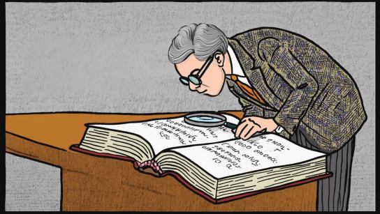
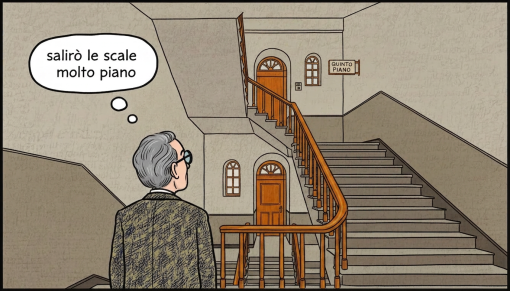
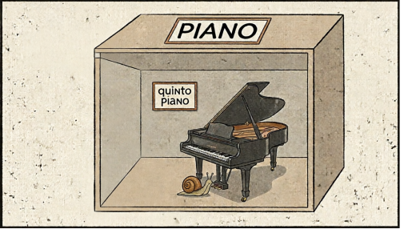

# La legge nascosta

| **Tema**                    | Analizzare la frequenza delle parole in un testo e derivare la legge di Zipf                                                                                                                                                                                                                                               |
|:----------------------------|:---------------------------------------------------------------------------------------------------------------------------------------------------------------------------------------------------------------------------------------------------------------------------------------------------------------------------|
| **Obiettivi**               | Analizzare dati e interpretarli sviluppando deduzioni e ragionamenti sugli stessi anche con l’ausilio di rappresentazioni grafiche.  Riconoscere che il machine learning è un tipo di programmazione utilizzato nell'IA che permette agli algoritmi di apprendere dai dati e fare previsioni (**CS3.4.09, Digcomp3.0**) |
| **Pre-requisiti**           | Distribuzione di frequenze, proprietà dei logaritmi e delle potenze                                                                                                                                                                                                                                                        |

## Analisi del testo

Cerchiamo tramite la matematica, come fece il linguista statunitense George Kingsley Zipf (1902-1950),
la presenza di un curioso schema nascosto tra le
parole di un testo qualsiasi con l'obiettivo di capire qualcosa di nuovo sui
modelli di IA generativa. 

### Contiamo le parole

Per analizzare il testo bisogna, innanzitutto, contarne le parole. 
Ad esempio, consideriamo la frase: 

"Ho deciso di salire le scale molto piano, 
l'ufficio si trovava al quinto piano senza ascensore!". 

Nella frase appare due volte la parola *piano* con diversi significati. Definiamo:

1. **parola token** una singola occorrenza di una stringa all'interno del testo, in questo caso, abbiamo due *parole
token* piano;
2. **parola tipo** la classe di tutti i token che hanno la stessa sequenza di caratteri, quindi *la classe* piano 
che rappresenta tutte le parole token piano anche con diversi significati. 

Individuiamo le parole token nel nostro testo e cerchiamo di analizzarne le frequenze.

### Analisi delle frequenze delle parole di un testo

Calcoliamo per ogni *parola tipo*:

1. la **frequenza assoluta**, cioè è il numero di parole token che appartengono a quella classe,
2. la **frequenza relativa**, pari alla frequenza assoluta diviso la lunghezza del testo o *corpus*, 
cioè il numero totale delle sue parole token.

Ordiniamo le parole tipo in base alla loro frequenza decrescente ottenendo il **rango** di una parola, 
cioè la posizione occupata dalla parola tipo all'interno dell'ordinamento.

| Parola tipo | Frequenza assoluta | Frequenza relativa | Rango |
|-------------|--------------------|--------------------|-------|
| piano       | 2                  | 0.1429             | 1     |
| ho          | 1                  | 0.0714             | 2     |
| deciso      | 1                  | 0.0714             | 2     |
| ...         | ..                 | ...                | ...   |

### La legge nascosta

Cerchiamo di capire la legge nascosta partendo da un archivio 
dei contenuti di Wikipedia e messo a disposizione sulla piattaforma 
[Hugging Face](https://huggingface.co/datasets/Salesforce/wikitext) (Merity et al., 2016). 
I dataset messi a disposizione sono tre:
1. train
2. test
3. validation

## Esercitazione 

### Parte 1

Apriamo il notebook Esercitazione_parte1_3.ipynb:
1. Importiamo i dati di Wikipedia;
2. Individuiamo le *parole token*;
3. Calcoliamo la frequenza assoluta e relativa di una *parola tipo*;
4. Ordiniamo le parole in base alla loro frequenza decrescente;
5. Costruiamo un grafico log-log, cioè in cui la cui scala di entrambi gli assi cartesiani è logaritmica. Sull'asse
delle ordinate abbiamo *il logaritmo della frequenza relativa*, mentre su quello delle ascisse il *logaritmo del rango*.

### Parte 2

Apriamo il documento Esercitazione_parte2.pdf e seguiamo le istruzioni per trovare la legge nascosta.

### Parte 3
Riapriamo il notebook Esercitazione_parte1_3.ipynb e verifichiamo la legge che abbiamo trovato con i dati a disposizione.
Riflettiamo sul significato della Legge di Zipf, il famoso linguista, e su come questa legge possa influenzare i
modelli di IA generativa.

### Parte 4

Rispondiamo e riflettiamo su queste domande:

1. Quali sono le conseguenze della legge di Zipf sull'AI?
2. Potrebbe sempre esserci una parola che non è mai stata vista in un testo?

### Fonti

Linguistica computazionale, Alessandro Lenci, Serena Auriemma, Martina Miliani (Hoepli, 2025)

