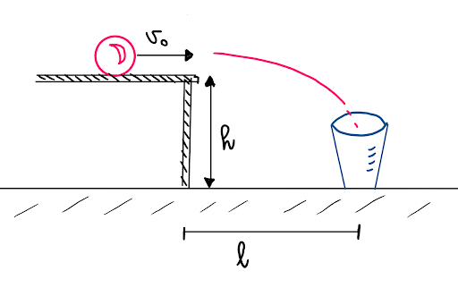
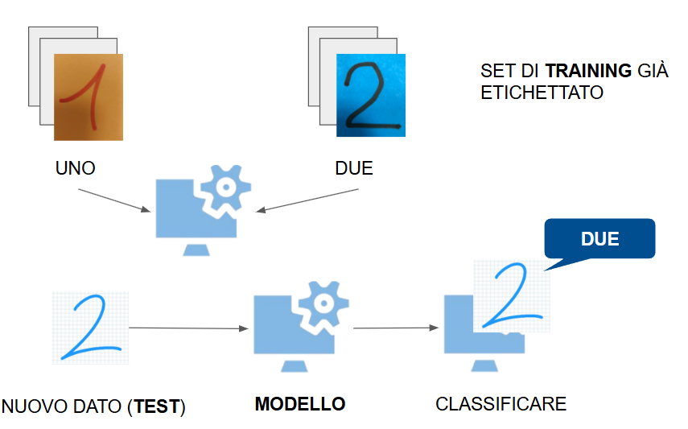

# L'importanza dei dati

| **Tema**                 | Costruzione di una **matrice di confusione** per confrontare due modelli di ML                                                                   |
|:-------------------------|:-------------------------------------------------------------------------------------------------------------------------------------------------|
| **Scopo (DigComp)**      | Comprendere come dati e addestramento influenzano l'affidabilità dell'IA (**CS1.2.08**)                                                          |
| **Durata**               | 1 ora                                                                                                                                            |
| **Target**               | Studenti del Biennio                                                                                                                             |
| **Setting della classe** | Dividere la classe in due gruppi, a un gruppo viene assegnato il modello A e ad un gruppo il modello B. Assegnare un computer ogni due studenti. |

## Introduzione al machine learning

### La biglia cade nel cestino?
Cerchiamo un modello che ci aiuti a prendere una decisione e a dire se la biglia cade 
nel cestino.



#### Prima dell'IA...

Usiamo un **modello deterministico** ovvero le leggi della fisica. Assumendo una velocità iniziale orizzontale $v_0$ e un'altezza del tavolo $h$, le equazioni del moto sono:

$$
\begin{cases} 
x(t) = v_0 \cdot t \\
y(t) = h - \frac{1}{2}g t^2
\end{cases}
$$

Dove:
*   $g \approx 9.81 m s^{-2}$ è l'accelerazione di gravità.
*   $t$ è il tempo trascorso dal distacco.

Il tempo di volo $t_f$ si ottiene ponendo $y(t) = 0$:

$$ t_f = \sqrt{\frac{2h}{g}} $$

La distanza orizzontale $l$ è:

$$ l = v_0 \cdot \sqrt{\frac{2h}{g}} $$

Noti
*   $v_0 = 0.560ms^{-1}$.
*   $l == 22cm$.

L'algoritmo sarà:
```text
SE l = 22 ALLORA
    SCRIVI "si"
ALTRIMENTI
    SCRIVI "no"
FINE SE
```

#### Dopo l'IA...

Considero i seguenti dati **raccolti da una serie di esperimenti**:

| $v_0$ (m/s) | $h$ (cm) | $l$ (cm) | Target |
|:-----------:|:--------:|:--------:|:------:|
|    0.56     |   76.1   |    22    |   SI   |
|    0.56     |   76.1   |    30    |   NO   |
|     0.7     |    80    |    22    |   NO   |
|     0.7     |    80    |    35    |   NO   |
|     0.7     |    80    |    28    |   SI   |
|    0.49     |    80    |    30    |   NO   |
|    0.49     |    80    |    19    |   SI   |
|    0.56     |    80    |    19    |   NO   |
|     0.7     |    75    |    31    |   NO   |

Gli algoritmi di **Intelligenza Artificiale** IA si basano sul **Machine Learning** ML.
Il Machine Learning si occupa di sviluppare algoritmi e modelli che apprendono dai dati
riconoscendo dei pattern senza essere esplicitamente
programmati e quindi senza conoscere esplicitamente le leggi 
che regolano il fenomeno.

La base del modello non è più la legge fisica ma sono i dati. Proviamo a costruire un modello 
che partendo da delle immagini, riconosce se in una nuova immagine viene rappresentato un 
numero uno o un numero due.

## Implementazione del modello

### L'immagine rappresenta un numero uno e un numero due?

Per rispondere a questa domanda utilizziamo due modelli di IA, **modello A** e **modello B**, già addestrati
tramite l'app [teachablemachine](https://teachablemachine.withgoogle.com/train/image). I due modelli sono in grado
di interpretare un'immagine e riconoscere se essa rappresenti un numero uno o un numero due.



### Il modello
1. **Dati di training**: scarica i file del modello a te assegnato da questa cartella: [Modelli TM](./modelli).
2.  **Modello**: [Apri Teachable Machine](https://teachablemachine.withgoogle.com/train/image), carica il modello 
a te assegnato cliccando su "Apri progetto da file" e "Addestra il modello".
3. **Dati di Test**: scarica le immagini dala cartella [Immagini di Test](./dati_test) per testare il modello.
4. **Previsione**: dal menù a tendina sulla destra scegliere "File" e controllare la previsione.

## Esercitazione

### Come faccio a capire se entrambi i modelli sono buoni?

Un metodo per valutare la performance di un modello è calcolare la **matrice di confusione**:


|                   | Target Reale: **1** | Target Reale: **2** |
|:------------------|:-------------------:|:-------------------:|
| **Predizione: 1** |   **Vero 1 (v1)**   |    Falso 1 (f1)     |
| **Predizione: 2** |    Falso 2 (f2)     |   **Vero 2 (v2)**   |

L'accuratezza indica la percentuale di risposta corretta del modello sul totale delle risposte:

$$ Accuracy = \frac{v1 + v2}{v1 + v2 + f1 + f2} $$

### Matrice di confusione con Python

1. **Previsione**: dal menù a tendina sulla destra scegliere "File" e controllare la previsione per ogni immagine
contando quanti $v1, v2,f1,f2$ ci sono.
2. **Matrice di confusione**: Apri il notebook Colab caricato in classroom e inserisci i tuoi conteggi.
3. **Rispondi alle domande sul Notebook** 

